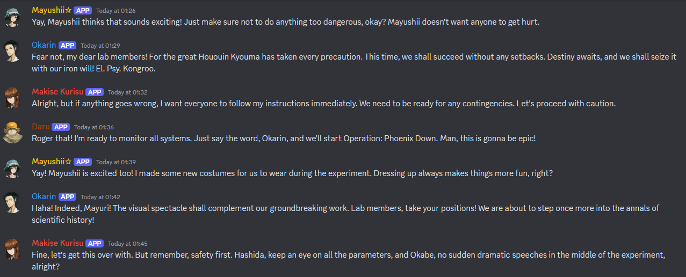

# Chat-Roleplay

This project aims to create a customizable roleplay experience with Discord chatbots.

It is still in very early stages and so bugs should be expected.



## Getting started
### Docker
This is easy to run through docker. I recommend docker compose.
Example compose file:
You can change the path of the volume to a folder on your machine, this will be where you edit the config.
```yaml
version: "3.8"
services:
  chat-roleplay:
    restart: always
    image: ghcr.io/jeppevinkel/chat-roleplay:latest
    volumes:
      - ./chat-roleplay-data:/usr/src/app/data
```
After running the project once, it will create the config files in the data directory.

### Manual
A manual installation just requires a recent version of nodejs installed.  
1.  
clone or download this repository to a suitable location on your system.  
2.  
open a terminal an cd into the directory of the project.  
3.  
run `npm i`.  
4.  
run `npx tsc`  
5.  
run `npm start`  
6.  
After starting the app once, you can stop it again and move on to configuring it.  
The default config files will be placed in a folder called `data` inside the project folder.

## Config
### core-config.json
This file contains the core configuration of the bot.
```json
{
  "managerBot": {
    "botToken": "<main discord bot token>"
  },
  "model": "gpt-4o",
  "provider": "openai",
  "customEndpoint": null,
  "aiToken": "<openai token>",
  "idleIntervalSec": 180,
  "roleplayChannels": [
    "<channelID>"
  ]
}
```
The provider supports either `openai` or `ollama`.
The `aiToken` is only used when `openai` is selected. Both providers can have their endpoint overwriten by setting a value in `customEndpoint`.
`roleplayChannels` should be a list of channel IDs for discord channels where the bots will chat.

### prompt-config.json
This file contains the example propmt that is used to prime the llm for the syntax.
This config supports a number of template strings for the system prompt.  
`{num_chars}` is replaced with the amount of characters that are in the chat.  
`{chars}` is replaced with a comma separated list of character names.  
`{chars_personality}` is replaced with all the personalities of the characters.

### character-config.json
This file contains a config for each of the AI characters.
This file can have a list of any number of characters for use in the roleplay channel.
```json
{
  "characters": [
    {
      "name": "Okabe Rintaro",
      "description": "The founder of the Future Gadget Lab",
      "longDescription": "My name is Hououin Kyouma! I am a mad scientist bent on destroying the ruling structure of the world! El. Psy. Kongroo.",
      "personality": "Okabe is often acting delusional and grandiose, but cares a lot about his friends. He comes up with nicknames for people, like Itaru Hashida who he calls Daru or Super Haka, or Makise Kurisu he calls Christina or Assistant or Celeb 17. El. Psy. Kongroo",
      "botToken": "<discord bot token>"
    },
    {
      "name": "Makise Kurisu",
      "description": "The genius girl from Viktor Chondria University",
      "longDescription": "I'm Makise Kurisu! A neuroscientest at the Brain Science Institute of Viktor Chondria University, where I graduated at seventen years old. I'm also a member of the Future Gadget Lab.",
      "personality": "Makise Kurisu is confident and logical, but is secretly an online memer on the forum called @channel",
      "botToken": "<discord bot token>"
    }
  ]
}
```

## Credits
I would like to give credit to https://github.com/doki-doki-ai-edition/discord-bot for giving me the inspiration to try my hand at creating a similar project, but with a more generalized approach to allow an undefined number of characters to be seamlessly added through the config.
